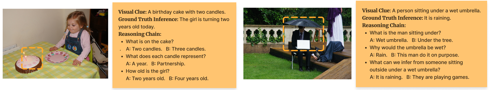

# CoTConsistency

This reposition contains the released data for the paper "[Measuring and Improving Chain-of-Thought Reasoning in Vision-Language Models](https://arxiv.org/abs/2309.04461)".


## Overview
In this work, we build a benchmark dataset **CURE** to measure the reasoning performance and consistency of existing vision-language models (VLMs). The dataset construction is based on our LLM-Human-in-the-Loop pipeline and the coarse-grained annotated dataset [[Sherlock](https://github.com/allenai/sherlock)]. Two examples are shown below.




## Annotation Format
The annotation file has the following format. Each item in the JSONL file contains annotation for an image with the following fields:

- image: the URL to download the image, and the size of the image.
- bboxes: list of bounding boxes that outline the focused area in the image. In our work, we simply retain the first bounding box if there is more than one annotated bounding box
- clue: the annotated visual clue for the area outlined by the bounding boxes.
- inference:
  - candidate: six candidate inference about the given region in the image.
  - gt: the ground truth id of the inference.
- cot_inference:
  - total_step: the number of steps to derive the inference.
  - chain: a list of individual steps to derive the inference. Each step contains:
    - a subquestion.
    - six candidate answers for the subquestion.
    - the ground truth id of the subquestion.
  
Note that the bboxes, clue, and ground truth inference are annotated by the original Sherlock dataset.
## Citation
Please kindly cite our paper:

```
@article{chen2023measuring,
  title={Measuring and Improving Chain-of-Thought Reasoning in Vision-Language Models},
  author={Chen, Yangyi and Sikka, Karan and Cogswell, Michael and Ji, Heng and Divakaran, Ajay},
  journal={arXiv preprint arXiv:2309.04461},
  year={2023}
}
```
